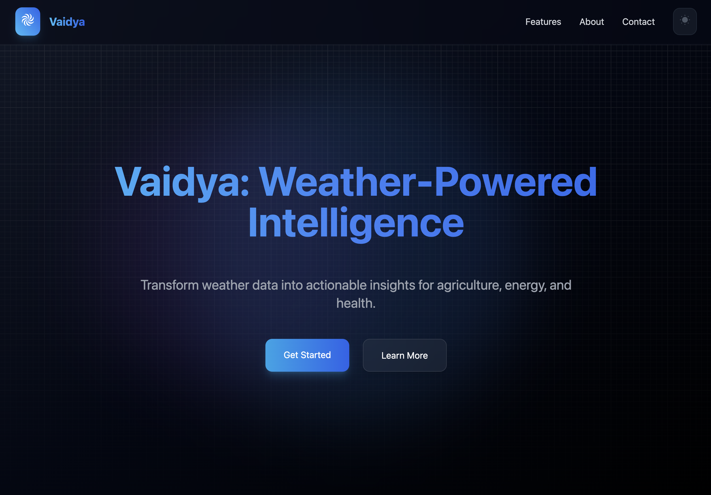

# Vaidya: Making weather based predictions

## Description

This project, developed as part of our DOA coursework, focuses on analyzing weather data to make various predictions that can impact multiple sectors. These predictions include:

- Energy Generation: Estimating the amount of energy that can be generated based on weather patterns.
- Air Quality: Taking in the current quality of air and the weather and predicting potential health issues that may arise.
- Crop Yield: Predicting crop yield based on weather conditions such as temperature, rainfall, and sunlight.
- Pests and Diseases: Forecasting the likelihood of pest infestations or crop diseases using weather data.

## Stack

- FastAPI
- Nuxt
- PyTorch
- Scikit-Learn

### WIP Integration

- HDFS
- RabbitMQ
